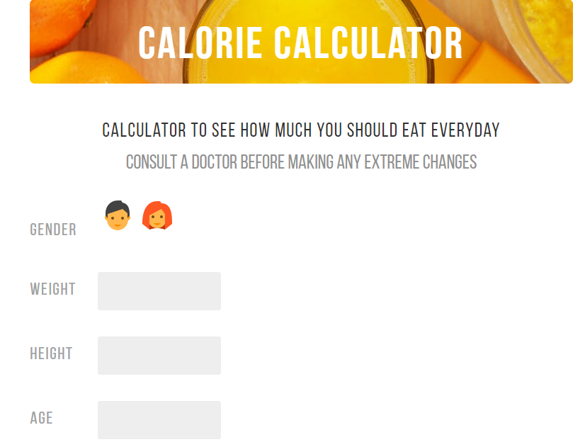

# Health Calculator

Health Calculator is a tool designed to help users calculate their total daily energy expenditure (TDEE)
using the Harris-Benedict equation.



## Getting started

To get started:
```
npm install
npm run start
```

Production environments:
```
npm run build
```

## Development

TODO(S):
- (Feature) Login
    - Integrate backend system + MongoDB
    - Integrate login system
- (Feature) Weight tracking
    - Make a whole new tab in dashboard to record daily weigh in
    - Graph for daily weight